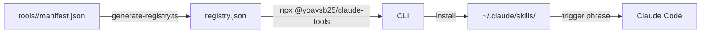

# claude-code-tools

A curated registry of Claude Code skills and automation tools — browsable, installable, and production-grade.

```bash
npx @yoavsb25/claude-tools list
npx @yoavsb25/claude-tools install ocado-shopper
```

Built for **[Claude Code](https://claude.ai/code)** users who want AI that does things, not just talks about them.

---

## What's inside

| Name | Type | Category | Complexity | Description |
|------|------|----------|------------|-------------|
| [add-todo](./tools/add-todo/) | skill | productivity | simple | Adds tasks to your Apple Reminders app via natural language directly from Claude Code |
| [linkedin-experience-writer](./tools/linkedin-experience-writer/) | skill | productivity | simple | Writes polished LinkedIn experience bullets for a single project a tech professional worked on, with 2 alternative phrasings per bullet so the user can choose the best fit |
| [run-todos](./tools/run-todos/) | skill | productivity | simple | Fetches your Apple Reminders todo list and runs them as Claude Code tasks automatically |
| [tfl-refund](./tools/tfl-refund/) | skill | finance | simple | Guides you through claiming a TfL refund for overcharges, incomplete journeys, or maximum fares |
| [amazon-shopper](./tools/amazon-shopper/) | skill | shopping | intermediate | Searches Amazon for products, compares options, and adds the best match to your basket using Claude Code and Playwright |
| [github-profile-refactor](./tools/github-profile-refactor/) | skill | developer-tools | intermediate | Refactors and elevates a GitHub profile README — improving readability, personal brand, and content quality |
| [github-project-picker](./tools/github-project-picker/) | skill | career | intermediate | Picks the best GitHub projects to showcase on a resume for a specific job and writes tailored, resume-ready descriptions for each |
| [ocado-shopper](./tools/ocado-shopper/) | skill | shopping | intermediate | Smart Ocado grocery shopper — reads a weekly list from Apple Notes, finds best-value products, and fills the trolley |
| [oyster-audit](./tools/oyster-audit/) | skill | finance | intermediate | Audits TfL Oyster card travel history against correct fares and detects potential refunds |
| [process-emails](./tools/process-emails/) | skill | productivity | intermediate | Fully-automatic email-to-todo pipeline — reads unread Gmail, extracts action items, and writes them to the Claude Tasks Apple Note |
| [product-manager](./tools/product-manager/) | skill | productivity | intermediate | Product thinking partner for PRDs, user stories, roadmaps, and feature prioritization |
| [resume-tailor](./tools/resume-tailor/) | skill | career | intermediate | Tailors a resume to a specific job posting by pulling from work documentation and saving a polished markdown output |
| [trip-expense-report](./tools/trip-expense-report/) | skill | finance | intermediate | Generates a structured expense report from trip receipts and bank statements using Claude Code |
| [ui-ux-expert](./tools/ui-ux-expert/) | skill | developer-tools | intermediate | Opinionated UI/UX design consultant for specs, style guides, and layout decisions |
| [grocery](./tools/grocery/) | tool | shopping | advanced | Basket price comparator — scrapes Tesco, Ocado, and Waitrose and uses Claude to match items to their best-value equivalent |
| [software-architect](./tools/software-architect/) | skill | developer-tools | advanced | Senior software architect for system design and architectural decision records (ADRs) |
| [tube-fare-auditor](./tools/tube-fare-auditor/) | tool | finance | advanced | Advanced TfL Oyster card auditor — verifies railcard discounts, detects maximum fare charges, and produces a refund report |

---

## Quick start

**Browse the registry:**
```bash
npx @yoavsb25/claude-tools list
npx @yoavsb25/claude-tools list --category finance
npx @yoavsb25/claude-tools list --complexity simple
```

**Get details on a tool:**
```bash
npx @yoavsb25/claude-tools info tube-fare-auditor
```

**Install a skill into Claude Code:**
```bash
npx @yoavsb25/claude-tools install ocado-shopper
# → copies SKILL.md to ~/.claude/skills/ocado-shopper.md
```

Once installed, trigger the skill by phrase or slash command inside Claude Code:
```
/ocado-shopper
"do my Ocado shop"
```

---

## How it works



Each tool has a `manifest.json` that declares its type, category, complexity, install targets, and requirements (platform, MCP servers, env vars). The CLI reads the registry and handles installation with pre-flight checks.

---

## Architecture

```
claude-code-tools/
├── tools/                    ← all skills and tools
│   └── <name>/
│       ├── manifest.json     ← structured metadata
│       ├── SKILL.md          ← Claude Code skill definition
│       └── README.md         ← usage documentation
├── cli/                      ← @yoavsb25/claude-tools npm package
│   └── src/
│       ├── commands/         ← list, info, install
│       └── registry.ts       ← fetches registry.json from GitHub
├── scripts/
│   └── generate-registry.ts  ← regenerates registry.json from manifests
├── registry.json             ← auto-generated index of all tools
├── manifest.schema.json      ← JSON Schema for manifest validation
└── .github/workflows/
    ├── validate.yml          ← validates manifests + builds CLI on every PR
    └── update-registry.yml   ← auto-updates registry.json on manifest changes
```

---

## Contributing

Want to add a skill? See [CONTRIBUTING.md](./CONTRIBUTING.md).

---

## License

MIT
