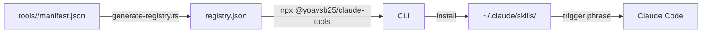

# claude-code-tools

A curated registry of Claude Code skills and automation tools — browsable, installable, and production-grade.

```bash
npx @yoavsb25/claude-tools list
npx @yoavsb25/claude-tools install ocado-shopper
```

Built for **[Claude Code](https://claude.ai/code)** users who want AI that does things, not just talks about them.

---

## What's inside

| Name | Type | Category | Complexity | Description |
|------|------|----------|------------|-------------|
| [add-todo](./tools/add-todo/) | skill | productivity | simple | Adds tasks to Apple Reminders via natural language |
| [run-todos](./tools/run-todos/) | skill | productivity | simple | Executes pending Apple Reminders tasks via Claude Code |
| [tfl-refund](./tools/tfl-refund/) | skill | finance | simple | Guides you through claiming a TfL refund for overcharges |
| [amazon-shopper](./tools/amazon-shopper/) | skill | shopping | intermediate | Searches Amazon, picks the best match, adds to basket |
| [github-profile-refactor](./tools/github-profile-refactor/) | skill | developer-tools | intermediate | Audits and rewrites a GitHub profile README |
| [ocado-shopper](./tools/ocado-shopper/) | skill | shopping | intermediate | Reads your grocery list from Apple Notes, shops Ocado |
| [oyster-audit](./tools/oyster-audit/) | skill | finance | intermediate | Lightweight TfL Oyster card charge audit |
| [trip-expense-report](./tools/trip-expense-report/) | skill | finance | intermediate | Generates a structured expense report from a Wise CSV |
| [grocery](./tools/grocery/) | tool | shopping | advanced | Scrapes Tesco, Ocado, Waitrose and finds the cheapest basket |
| [tube-fare-auditor](./tools/tube-fare-auditor/) | tool | finance | advanced | Full TfL audit — checks railcard discounts, surfaces refunds |

---

## Quick start

**Browse the registry:**
```bash
npx @yoavsb25/claude-tools list
npx @yoavsb25/claude-tools list --category finance
npx @yoavsb25/claude-tools list --complexity simple
```

**Get details on a tool:**
```bash
npx @yoavsb25/claude-tools info tube-fare-auditor
```

**Install a skill into Claude Code:**
```bash
npx @yoavsb25/claude-tools install ocado-shopper
# → copies SKILL.md to ~/.claude/skills/ocado-shopper.md
```

Once installed, trigger the skill by phrase or slash command inside Claude Code:
```
/ocado-shopper
"do my Ocado shop"
```

---

## How it works



Each tool has a `manifest.json` that declares its type, category, complexity, install targets, and requirements (platform, MCP servers, env vars). The CLI reads the registry and handles installation with pre-flight checks.

---

## Architecture

```
claude-code-tools/
├── tools/                    ← all skills and tools
│   └── <name>/
│       ├── manifest.json     ← structured metadata
│       ├── SKILL.md          ← Claude Code skill definition
│       └── README.md         ← usage documentation
├── cli/                      ← @yoavsb25/claude-tools npm package
│   └── src/
│       ├── commands/         ← list, info, install
│       └── registry.ts       ← fetches registry.json from GitHub
├── scripts/
│   └── generate-registry.ts  ← regenerates registry.json from manifests
├── registry.json             ← auto-generated index of all tools
├── manifest.schema.json      ← JSON Schema for manifest validation
└── .github/workflows/
    ├── validate.yml          ← validates manifests + builds CLI on every PR
    └── update-registry.yml   ← auto-updates registry.json on manifest changes
```

---

## Contributing

Want to add a skill? See [CONTRIBUTING.md](./CONTRIBUTING.md).

---

## License

MIT
